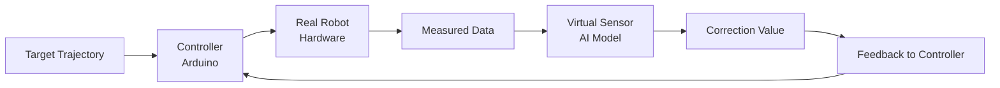

# Delta Robot with Virtual Sensing

## 📌 프로젝트 개요
저가형 델타 로봇의 하드웨어 한계를 **가상 센싱 기술**과 **모델 기반 보정**을 통해 극복하는 것을 목표로 한다.

- 저가 모터 + 3D 프린팅 프레임 사용
- 시뮬레이션 기반 디지털 트윈 구축
- 가상 센싱을 통한 정밀도 보정

---

## 🎯 목표
- 시뮬레이션 결과와 실제 로봇 동작을 최대한 일치시키기
- 센서 없이도 높은 위치 정확도 확보
- 저가 하드웨어의 한계 극복

---

## 🧠 핵심 기술
- Delta Robot Inverse Kinematics
- Multibody Dynamics (RecurDyn)
- Structural Analysis (Nastran)
- Simscape 기반 Digital Twin
- Virtual Sensing (AI + Physics Hybrid)

---

## 🧩 시스템 구조

---

## 🛠️ 사용 툴
- MATLAB / Simulink / Simscape
- RecurDyn
- Nastran
- Arduino
- PyTorch
- Unity (optional)
- GitHub

---

## 👥 팀원 역할

| 팀원 | 역할 |
|------|------|
| S | 동역학 해석, 진동 분석 |
| L | 시스템 통합, 가상센싱 |
| Y | 아두이노 제어 |
| T | 기구 설계 |
| N | 구조/응력 해석 |

---

## 📂 폴더 구조

delta-robot-virtual-sensing/
├─ docs/
├─ kinematics/
├─ simulation/
├─ hardware/
├─ cad/
├─ data/
├─ control/
├─ virtual_sensor/
└─ experiments/

---

## 🚀 진행 단계

진행 현황은 아래 체크박스로 바로 갱신할 수 있습니다.

- [ ] 1단계 설계 완료
- [ ] 2단계 시뮬레이션 완료
- [ ] 3단계 제작 완료
- [ ] 4단계 가상센싱 완료
- [ ] 5단계 검증 완료

### 1단계: 설계
- 기구 규격 정의
- 역기구학 수식 정리
- 모터 및 재료 선정

### 2단계: 시뮬레이션
- 구조 해석
- 동역학 해석
- 디지털 트윈 구축

### 3단계: 제작
- 3D 프린팅 및 조립
- 아두이노 제어 구현

### 4단계: 가상센싱
- 데이터 비교 및 학습
- 오차 보정

### 5단계: 검증
- 궤적 오차 분석
- 시스템 신뢰성 평가
